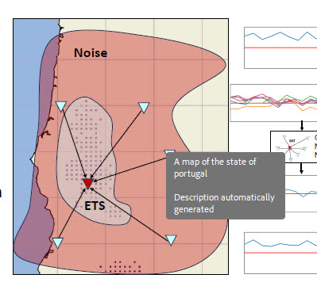

# PORTable Uniform Geophysical AnaLysis (PORTUGAL) Code(s)

## Not for production use

## Help, how do I download the code requirements!?

Por primera vez, estás creando la fila como esta:
* conda env export > <env_name>.yml

Entonces,
* conda env create -f <env_name>.yml
## COSMIC Selector
Data assimilation in Julia of the Bi-Gaussian Ensemble Kalman Filter (BGEnFK) for use in the COseismic Statistics MIxing Codes (COSMIC).
